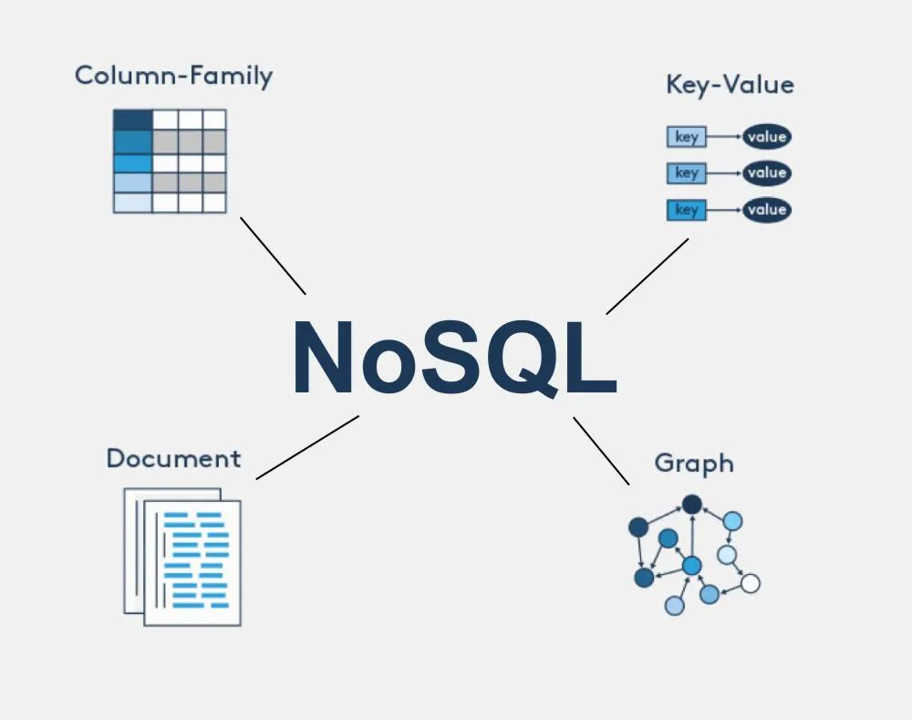

## NoSQL 데이터베이스

- 데이터를 저장하는 방식에 따라 **Key-Value, Document, Wide-Column, Graph** 유형이 있다. 
- 각 유형은 특정 용도에 더 적합하며, **Key-Value는 빠른 데이터 조회에, Document는 유연한 데이터 저장에, Wide Column은 대규모 데이터 처리에, Graph는 복잡한 관계 모델링**에 사용된다.

### NoSQL 주요 특징
1. **비일관성**
- NoSQL은 비일관성의 특징을 가진다.
- RDBMS와 다르게 ACID를 충족하지 않는다.

2. **분산저장**
- NoSQL은 수평적 확장을 바탕으로, 대량 데이터와 컴퓨팅 부하 처리가 가능하다.

3. **스키마리스**
- NoSQL은 데이터 구조를 미리 정의할 필요가 없기 때문에 비형식적인 데이터를 저장하는데 용이하다.
- 하지만, NoSQL은 데이터베이스가 스키마를 직접 관리하지 않는것을 의미할 뿐, 데이터 타입에 따른 암묵적인 스키마는 존재한다.

 

## 1. Key-Value
- Key를 이용해 value에 접근하는 구조로, 저장과 조회에 충실한 가장 기본적인 형태를 가진다. 

### 특징
- 빠른 데이터 조회와 관리에 용이
- 캐싱이나 세션 관리에 주로 사용

### 사용사례
- **많은 양의 단순 데이터를 빠르고 효율적으로 저장하고 검색해야 할 때** 사용(캐싱, 분산 시스템, 광고 기술 및 IoT와 같은 사용 사례에 적합)
- 일반적으로 사용자 프로필, 제품 목록 또는 세션 데이터와 같은 많은 수의 작고 간단한 정보가 포함되는 데이터
- 자주 필요하지만 영구적으로 저장할 필요는 없는 데이터 캐싱
- 애드테크 광고 기술 산업은 실시간 입찰 및 광고 타겟팅의 필요성으로 사용자 프로필, 광고 인벤토리 및 입찰 요청을 저장하는 데 사용할 수 있으므로 실시간 의사 결정 및 광고 배치에 활용
- IoT 장치에서 생성되는 대량의 데이터는 데이터를 빠르고 효율적으로 저장하고 검색할 수 있는 데이터베이스가 필요

### 종류
- `Redis`, `AWS DynamoDB`

## 2. Document 
- JSON과 유사한 문서 형태로 데이터베이스의 값을 문서(Document)로 저장하는 것이 가장 큰 특징이다.

### 특징
- 계층적 트리 데이터 방식으로 저장 (XML, JSON, BSON 등)
- 데이터를 저장하기 전에 스키마를 별도로 정의하지 않으며, document가 스키마
- 데이터를 여러 서버에 분산 저장할 수 있어 장애가 발생하더라도 대응에 유리
- **웹 애플리케이션 및 로그 저장에 적합**

### 사용사례
- **콘텐츠 관리 시스템(CMS)**
    - 문서 데이터베이스의 일반적인 사용 사례로 기사, 이미지, 비디오 및 메타데이터와 같은 다양한 비정형 또는 반정형 데이터를 처리해야할 때 적합
    - 문서 데이터베이스는 이러한 유형의 데이터를 저장하고 검색하는 효율적이고 확장 가능한 방법을 제공
- **전자상거래 애플리케이션**
    - 제품 카탈로그, 주문, 고객 프로필 및 기타 유형의 데이터를 관리하기 위해 빠르고 효율적이며 확장 가능한 데이터베이스가 필요
    - 문서 데이터베이스는 복잡하고 변화하는 데이터 구조를 처리할 수 있기 때문에 이러한 유형의 애플리케이션에 적합

그 외 **사물 인터넷(IoT), 소셜 미디어 애플리케이션, 모바일 애플리케이션**

### 종류
- `MongoDB`, `Amazon DocumentDB`, `Firebase`

## 3. Graph
- 데이터를 노드(Node)와 엣지(Edge)로 표현하여 관계를 중심으로 저장하는 방식을 가진다.

### 특징
- 노드는 key-value 값을 가지고 있고, 노드는 하나 이상의 레이블을 구성할 수 있다.
- 레이블 : 노드를 세트로 그룹화할 수 있는 그래프의 구성 요소로, 동일한 라벨이 붙은 모든 모드는 동일한 그룹에 속한다.
- 그룹화된 노드를 통해(레이블) 쿼리를 쉽게 작성하고 효율적으로 실행할 수 있다.

### 사용사례
- 지식 그래프, 소셜 네트워크, 추천 엔진, 사기 탐지 
- Facebook, Twitter, LinkedIn과 같은 사용자 데이터, 사용자 간의 관계, 플랫폼에서 공유되는 콘텐츠 등을 저장하는 데 사용

### 종류
- `Neo4j`, `Giraffe`, `Amazon Neptune`

## 4. Wide-Column
- 행(Row) 대신 컬럼(Column)을 기준으로 데이터를 저장하는 방식을 가진다.

### 특징
- Column Family Database라고도 하며, 대용량 데이터, 읽기와 쓰기 성능, 고가용성을 위해 설계
- Column과 Row를 사용해서 스키마를 정의하며, 여러 개의 Column 묶음을 뜻하는 Column Family 형태로 이루어져 있다.
- Document Database와 같이 미리 정의된 스키마를 사용하지 않으므로 원하는 시점에 Column을 추가할 수 있다.

### 사용사례
- 높은 쓰기 처리량, 대량 데이터, 실시간 분석, 시계열 데이터 및 동적 스키마 유형의 데이터를 처리하는 경우에 적합
- 소셜 미디어 사이트, 금융 거래 플랫폼 및 온라인 게임과 같이 자주 업데이트하는 상황
- 빅 데이터 분석, IoT 데이터 및 유전체학 연구

### 종류
- `HBase`, `Apache Cassandra`, `Google Cloud BigTable`

 

## 요약
- 관계면 Graph, 문서면 Document, 로그면 Wide-Column, 속도면 Key-Value

|구분|Document DB|Key-Value DB|Wide-Column DB|Graph DB|
|:-----:|:-----:|:-----:|:-----:|:-----:|
|성능	|높음	    |높음	    |높음| 가변적|
|확장성	|가변적(높음)|높음  	 |높음|	가변적|
|유연성	|높음	    |높음   	|준수| 높음|
|복잡성	|낮음       |없음	    |낮음| 높음|
|기능	|가변적(낮음)|가변적(없음)|최소| 그래프이론|

## NoSQL 간 선택 기준

| 질문 | Yes → 선택 | No → 다음 질문 |
| ----- | ----- | ----- |
| **1. 데이터 관계 탐색이 중요한가?** | **Graph DB** | ➡ 2 |
| **2. 필드 구조가 자주 바뀌고, 문서 단위로 다루기 좋은가?** | **Document DB** | ➡ 3 |
| **3. 쓰기 부하가 매우 크고, 로그/이벤트/센서 데이터가 대량인가?** | **Wide-Column DB** | ➡ 4 |
| **4. 아주 빠른 조회/세션/캐시가 필요한가?** | **Key-Value DB** | ➡ SQL 고려 |
| **5. 위 어느 것도 아니라면?** | SQL 또는 Multi-Model DB 검토 | - |